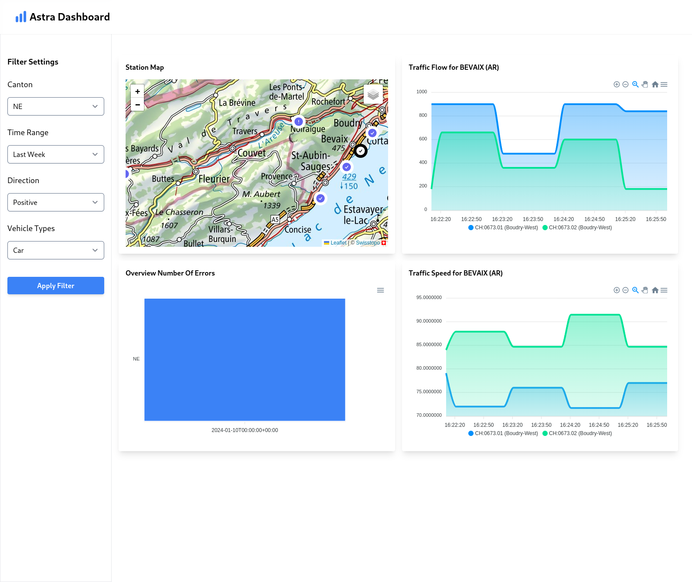

<div align="center">
    <h1>:car: ASTRA Realtime Dashboard</h1>
    <h2>Realtime Data Dashboard with ASTRA Dataset for Consultancy Project 2</h2>
    <br/>
    <br/>
    
</div>

## Clone the Repo

First of all clone this repository to a local destination of your choice

```bash
git clone https://github.com/yhutter-dv/fhgr-cp2-astra-dashboard.git ~/GitRepos/fhgr-cp2-astra-dashboard
```

## Scripts and Helper Files

In order to streamline some things we have created scripts. In order to use them
make sure they are executable, e.g

```bash
chmod +x *.sh
```

| Script                    | Purpose                                                                                                                                                                                                   |
| ------------------------- | --------------------------------------------------------------------------------------------------------------------------------------------------------------------------------------------------------- |
| run_influxdb.sh           | Starts and runs the InfluxDB Docker Container                                                                                                                                                             |
| stop_influxdb.sh          | Stops the InfluxDB Container.                                                                                                                                                                             |
| run_docker.sh             | Starts all necessary Docker Containers                                                                                                                                                                    |
| clean_influxdb_storage.sh | Clean the entire influxdb storage. Please note that for this to work the InfluxDB Container has to be stopped with the `stop_influxdb.sh` script.                                                         |
| /backend/preprocessing.py | Automatically parses a SOAP Request from [Open-Data-Plattform Mobilität Schweiz](https://opentransportdata.swiss/de/strassenverkehr/) and write the result as a `.json` file for MST as well as MSR data. |

## :pencil2: Setup for Local Development

> Note that it is important that you start each component in the correct order
> as described below (e.g First InfluxDB then FastAPI and then Frontend).

### Influx DB

You can run Influx DB locally via Docker. Please make sure you have docker
installed and it is actually running. After that you can start Influx DB by
executing the `run_influxdb.sh` script. InfluxDB should be available under this
[URL](http://127.0.0.1:8086/).

### FastAPI

The backend is implemented in Python. It is generally a good idea to create a
virtual environment and install the required packages local to this environment:

```bash
cd backend
python -m venv ./.venv
source ./.venv/bin/active.sh
pip install -r ./requirements.txt
```

#### Fill out the .env file

In order for the Backend to work properly you need to fill out the `.env` file
in the `backend directory`.

```bash
OPEN_TRANSPORT_DATA_AUTH_TOKEN=<YOUR-SECRET-TOKEN>
DOCKER_INFLUXDB_INIT_MODE=setup
DOCKER_INFLUXDB_INIT_USERNAME=fhgr-cp2
DOCKER_INFLUXDB_INIT_PASSWORD=fhgr-cp2
DOCKER_INFLUXDB_INIT_ORG=fhgr-cp2-org
DOCKER_INFLUXDB_INIT_BUCKET=fhgr-cp2-bucket
DOCKER_INFLUXDB_INIT_ADMIN_TOKEN=FWriHqU2mWlfCVuVWPjpC93UqGxVp_fNSH8eDoslH6t7NM7E_e93WChUoq2ypKaJe-xARNQGOrbHVCU7kiuJVg==
INFLUXDB_URL=http://127.0.0.1:8086
```

> :warning: Please do NOT check in the `.env` file with secret credentials

The last thing you would need to do is give the correct path to your configured
.env file inside the `app.py` file:

```python
...
ENV_FILE_PATH = "./.env"
...
```

#### Start FastAPI

In order to start FastAPI simply execute the following command

```bash
uvicorn app:app --port 6969 --reload
```

> Please note that you can enter any port number you want. Just make sure it
> matches with the one entered in the `.env` file under the frontend directory
> (see explanation below).

FastAPI should be available under this [URL](http://127.0.0.1:6969/docs).

> :warning: Be aware that the response of some endpoints like `stations`
> contains about 2MB of JSON so trying it out inside Swagger may cause your
> browser to hang.

### Frontend

The Frontend is written in Svelte (JavaScript) with some dependencies like
`Leaflet` and `ApexCharts`. First make sure that
[NodeJS](https://nodejs.org/en/) is installed. If possible choose the
**Current** Version.

Please also add the API Url of the FastAPI Backend to the .env file (under the
`frontend` directory):

```bash
VITE_API_URL=YOUR_API_URL
```

> :warning: Please do NOT check in the `.env` file with secret credentials

After that simply install all required packages by running

```bash
cd frontend
npm i
npm run dev
```

## :rocket: Setup for Deployment

In order to streamline the Deployment process we use
[Docker](https://docs.docker.com/engine/install/). Please make sure that it is
installed on your system and also that the `Docker Service is running`.

```bash
sudo systemctl start docker # Starts the docker service.
./run_docker.sh
```

After entering this command docker starts building the containers and pulling
down the necessary images. Please wait until this is completed.

> Pleas note that currently only the FastAPI and InfluxDB Part are integrated
> into docker. The frontend is not yet integrated and needs to be run locally
> (see `Open Points` below)

### FastAPI

FastAPI should be available under this [URL](http://127.0.0.1:8000/docs).

### InfluxDB

InfluxDB should be available under this [URL](http://127.0.0.1:8086/).

## :eyes: Open Points

Note that this project still has some rough edges noteably:

- [ ] Frontend needs to be integrated into the `docker-compose` file
- [ ] The number of requests on the frontend are currently too much. Each widget
      does its own request. A dedicated `/dashboard` endpoint could be
      introduced that returns the whole data for the entire dashboard, e.g only
      one Request would be needed
- [ ] For maintainability it would make sense to add some `static types` to the
      Frontend. This could easily be achieved by adding `TypeScript`.
- [ ] Currently the `total number of errors` does have some Error in the Flux
      Query (e.g returns an incorrect result). This needs to be investigated
- [ ] Define a retention policy for the buckets so that data older then x days
      gets deleted automatically. This is easily supported by InfluxDB out of
      the box see
      [here](https://docs.influxdata.com/influxdb/v2/reference/internals/data-retention/#bucket-retention-period).
- [ ] Currently everything is stored in a single bucket. It would make sense to
      have multiple buckets with different types of data granularity (e.g data
      per minute, per hour, per day etc.) Then the bucket could be dynamically
      choosen depending on the passed time range. Meaning if a time range of 1
      month is specified the data could get retrieved from the "one month
      bucket"
- [ ] Implement actually Live Mode for the Dashboard. This could be achieved by
      implementing a `WebSocket` connection on the FastAPI Backend. This way the
      frontend would not need to constantly polling the data (e.g the backend
      notifies the frontend when the data is available through a WebSocket
      message.)

## Used Ressources

| Link                                                                                                                           | Description                                                                     |
| ------------------------------------------------------------------------------------------------------------------------------ | ------------------------------------------------------------------------------- |
| [Why a .env?](https://blog.devgenius.io/why-a-env-7b4a79ba689)                                                                 | Contains useful information what .env files are and how they can be used        |
| [Open-Data-Plattform Mobilität Schweiz](https://opentransportdata.swiss/de/strassenverkehr/)                                   | API in order to retrieve Realtime Data on Mobility related topics               |
| [Make SOAP Requests](https://www.geeksforgeeks.org/making-soap-api-calls-using-python/)                                        | How to make SOAP Requests in Python                                             |
| [Speed up XML Parsing in Python](https://nickjanetakis.com/blog/how-i-used-the-lxml-library-to-parse-xml-20x-faster-in-python) | A good ressource for speeding up XML Parsing in Python                          |
| [FastAPI](https://github.com/tiangolo/fastapi)                                                                                 | A really fast REST API Library (pun intended) written in Python                 |
| [FastAPI CORS](https://fastapi.tiangolo.com/tutorial/cors/)                                                                    | Allow CORS in FastAPI                                                           |
| [FastAPI in Docker](https://fastapi.tiangolo.com/deployment/docker/)                                                           | How to setup FastAPI inside a Docker Container                                  |
| [InfluxDB in Docker](https://hub.docker.com/_/influxdb)                                                                        | How to setup InfluxDB inside a Docker Container                                 |
| [InfluxDB Python Client](https://github.com/influxdata/influxdb-client-python)                                                 | Sample Repo for working with InfluxDB and Python                                |
| [Svelte](https://svelte.dev/)                                                                                                  | A minimalistic JavaScript Framework with State Management and tiny Bundle Size. |
| [Heroicons](https://heroicons.com/)                                                                                            | Nice Icons designed by the makes of Tailwind                                    |
| [Leaflet](https://leafletjs.com/)                                                                                              | Tiny and efficient Map Library which does not require any Token.                |
| [Leaflet Swisstopo](https://leaflet-tilelayer-swiss.karavia.ch/)                                                               | Swisstopo support for Leaflet                                                   |
| [Apex Charts](https://apexcharts.com/)                                                                                         | Chart Library with lots of different chart types.                               |
| [Vite](https://vitejs.dev/guide/)                                                                                              | Super fast Web Bundler.                                                         |
| [Vite Environment Variables](https://vitejs.dev/guide/env-and-mode)                                                            | How to use environment variables in Vite.                                       |
| [Tailwind CSS](https://tailwindcss.com/)                                                                                       | CSS Framework.                                                                  |
| [Tailwind CSS Forms](https://github.com/tailwindlabs/tailwindcss-forms)                                                        | A Tailwind inspired styling for Form Elements.                                  |
